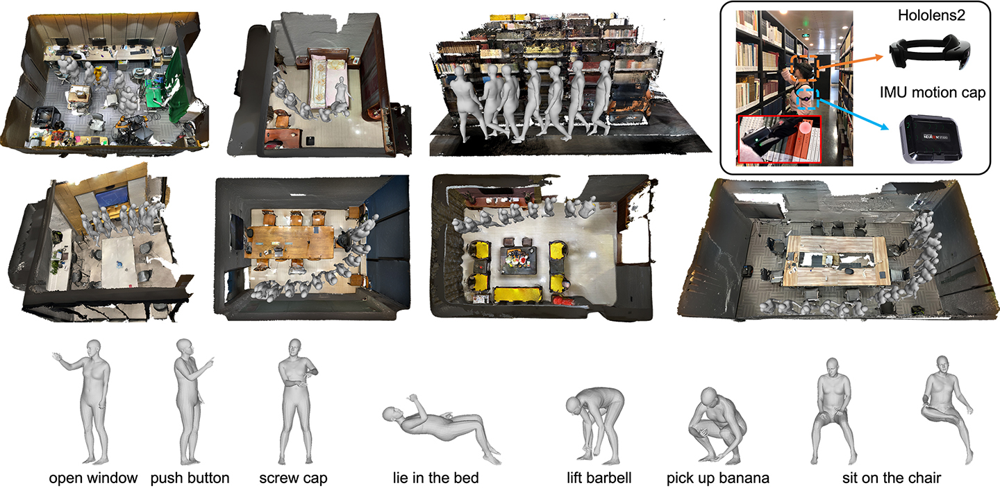

# GIMO: Gaze-Informed Human Motion Prediction in Context (ECCV 2022)
 

## Introduction

This is the official repo of our paper [GIMO: Gaze-Informed Human Motion Prediction in Context](https://arxiv.org/abs/2204.09443).

## Demo

A demo of our dataset:


Demo data can be downloaded from [**here**](https://drive.google.com/file/d/1cTF1zFcYbxAh8GZ5MsDK16C-iGubUgfn/view?usp=sharing)

## Quickstart

To setup the environment, firstly install the packages in requirements.txt:

```
pip install -r requirements.txt
```

Install PointNet++ as described [here](https://github.com/daerduoCarey/o2oafford/tree/main/exps) :

```
git clone --recursive https://github.com/erikwijmans/Pointnet2_PyTorch
cd Pointnet2_PyTorch
# [IMPORTANT] comment these two lines of code:
#   https://github.com/erikwijmans/Pointnet2_PyTorch/blob/master/pointnet2_ops_lib/pointnet2_ops/_ext-src/src/sampling_gpu.cu#L100-L101
# [IMPORTANT] Also, you need to change l196-198 of file `[PATH-TO-VENV]/lib64/python3.8/site-packages/pointnet2_ops/pointnet2_modules.py` to `interpolated_feats = known_feats.repeat(1, 1, unknown.shape[1])`)
pip install -r requirements.txt
pip install -e .
```

Download and install [Vposer](https://github.com/nghorbani/human_body_prior), [SMPL-X](https://github.com/vchoutas/smplx)

Download the pertained weight [here]() and put it in the checkpoints folder

For a quickstart, run:

```
bash scripts/eval.sh
```

You can download the full dataset and have a test

## To do list

* To release the full dataset and code of the paper.

### Citation
If you find this repo useful for your research, please consider citing:
```
@article{zheng2022gimo,
  title={GIMO: Gaze-Informed Human Motion Prediction in Context},
  author={Zheng, Yang and Yang, Yanchao and Mo, Kaichun and Li, Jiaman and Yu, Tao and Liu, Yebin and Liu, Karen and Guibas, Leonidas J},
  journal={arXiv preprint arXiv:2204.09443},
  year={2022}
}

```
